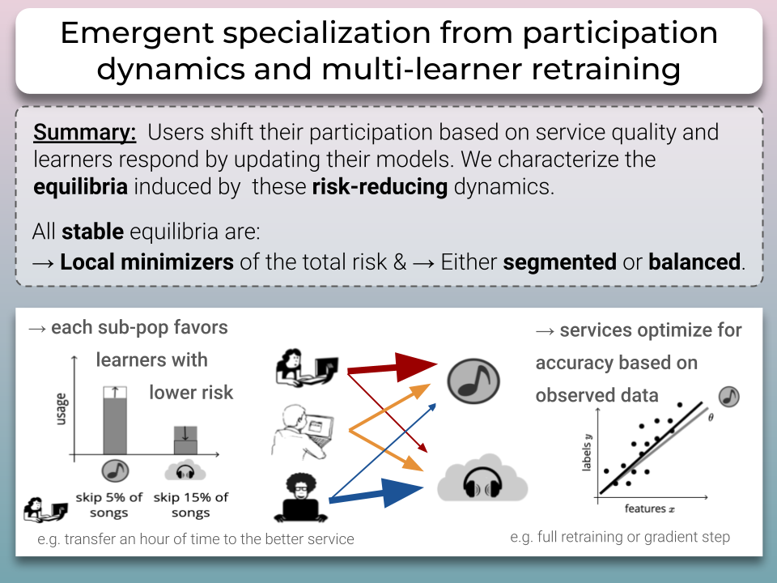

# Emergent specialization from participation dynamics and multi-learner retraining @AIStats2024

This repository contains the code to replicate the phots presented in our [paper](https://arxiv.org/pdf/2206.02667).



### Requirements

- Python 3.8 or higher
- pip (Python package installer)

## Instructions

1. **Clone the repository or download the source code.**

```
git clone git@github.com:mcurmei627/MultiLearnerRiskReduction.git
```

2. **Set up a virtual environment (Recommended).**
   Navigate to the project directory and run:

```
python -m venv env
source env/bin/activate # On Windows use env\Scripts\activate
```

3. **Install the required packages**
   Install all dependencies using the `requirements.txt` file:

```
pip install -r requirements.txt
```

4. **Run the Plots.ipynb notebook.**
